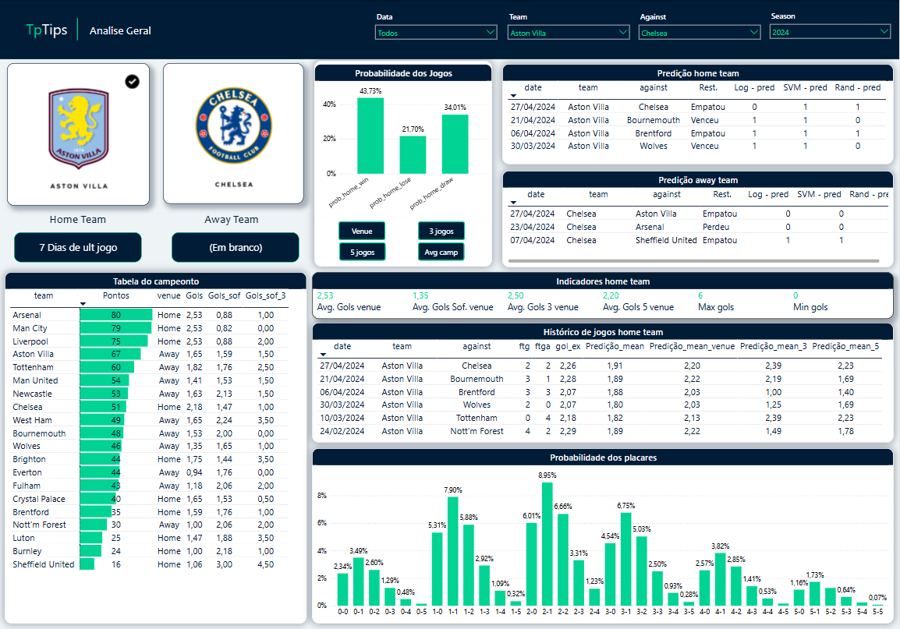

# ⚽ Predictive Modeling of Football Scores – Premier League (Over/Under 2.5 Goals)

This project aims to develop predictive models for football match outcomes in the English Premier League, focused specifically on the Over/Under 2.5 goals betting market. It uses statistical analysis and supervised machine learning to generate accurate goal predictions and support strategic sports betting decisions.

---

## 🎯 Project Objective

The main objective of this project is to predict the number of goals scored in Premier League matches using both:
- **Statistical methods** (Poisson distribution-based modeling)
- **Machine learning models** (Linear Regression, SVR, Random Forest)

Predictions are validated using **cross-validation** and error metrics such as:
- MAE (Mean Absolute Error)
- MSE (Mean Squared Error)
- RMSE (Root Mean Squared Error)

---

## 📚 Project Scope and Approach

### 1. **Data Collection**
- Match data was obtained through **web scraping** from football-data.co.uk, covering over 3,700 games from the last 10 Premier League seasons.
- The dataset includes goals, shots, fouls, cards, and corner statistics for home and away teams.

### 2. **Dataset Construction**
- Two separate datasets were created for home and away teams, with aggregated statistics like:
  - Goals scored/conceded
  - Shots and accuracy
  - Fouls and disciplinary actions
  - Rolling averages and trends

---

## 🧠 Feature Engineering

Several engineered features were created, such as:
- Expected goals (xG) scored and conceded
- Average performance over the last 1 to 7 matches
- Cumulative season performance (total goals, points, wins)
- Aggregated and normalized stats (mean, median, min, max, std)

---

## 📈 Statistical Modeling – Poisson Distribution

- Poisson regression was used to model the expected number of goals for each team.
- Probability distributions were calculated from 0 to 7 goals for each match.
- Poisson assumptions were validated:
  - Mean ≈ Variance (2.61 vs 2.66)
  - Shapiro-Wilk test rejected normality
  - Chi-square goodness-of-fit test confirmed Poisson adherence

---

## 🤖 Machine Learning Models

Three main supervised models were applied:
- **Linear Regression**
- **Support Vector Regressor (SVR)**
- **Decision Tree Regressor**

These were trained and validated under three feature selection strategies:
- Full feature set
- **SelectKBest**
- **Recursive Feature Elimination (RFE)** with Linear and RF estimators

---

## 🧪 Model Evaluation

All models were evaluated using:
- Cross-validation (k-fold)
- MSE, MAE, RMSE
- R² Score (model explanatory power)

### 🔥 Best Model:
- **Linear Regression + K-Best**:  
  MSE = 1.23 | RMSE = 1.11 | MAE = 0.89 | R² = 0.13

Other strong contenders:
- SVR + K-Best: MAE = 0.88
- Decision Tree Regressor + K-Best: consistent low error

---

## 📊 Dashboard & Visualization

A dashboard was created in **Power BI** using the exported predictions to explore:
- Historical scoring patterns
- Predicted probabilities by team and season
- Distribution comparison (real vs predicted)
- Scenarios for Over/Under 2.5 goal markets

### General Overview Page


---

## 📁 Folder Structure

```
/premier-league-prediction
│
├── Premier_League_Prediction_Detailed.ipynb
├── README.md
├── requirements.txt
├── /images
│   └── prediction-dashboard.png
└── LICENSE (MIT)
```

---

## 🚀 How to Run

1. Open `Premier_League_Prediction_Detailed.ipynb` on Google Colab
2. Install required libraries: `pandas`, `bs4`, `sklearn`
3. Authenticate your Google Drive
4. Execute cells in order to scrape, process, and model the data
5. Export final dataset to Google Sheets or CSV for Power BI

---

## 📊 Technologies Used

- **Python** (Colab, Pandas, Numpy, Scikit-learn, BeautifulSoup)
- **Machine Learning**: Linear Regression, SVR, Random Forest
- **Feature Selection**: SelectKBest, Recursive Feature Elimination (RFE)
- **Validation**: Cross-validation, MAE/MSE/RMSE
- **Visualization**: Power BI

---

## 📍 Data Source

- Match data: [football-data.co.uk](https://www.football-data.co.uk/)
- Contains public stats from Premier League matches (goals, cards, fouls, etc.)

---

## 👨‍💻 Author

**Tiago Ramos Plutarco Lima**  
Postgraduate in Data Science  
[linkedin.com/in/tiagoplutarco](https://www.linkedin.com/in/tiagoplutarco)
